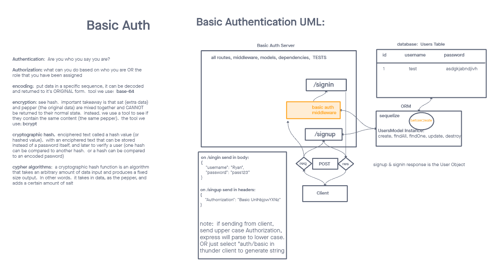

# LAB - Class 06

## Project: Basic auth

### Author: Ethan Storm

### Problem Domain

#### Phase 1

Deploy an Express server that implements [Basic Authentication](https://en.wikipedia.org/wiki/Basic_access_authentication), with signup and sign-in capabilities, using a Postgres database for storage.

### Links and Resources

[Github Actions](https://github.com/ShadowDraco/basic-auth/actions)
[Backend deployment](https://frolic-basic-auth.onrender.com)

### Collaboration

This server was adapted from a code fellows lab starter code

#### `.env` requirements

Port variable (PORT)
Postgres connection url (DATABASE_URL)

#### How to set up the application

make sure to have pgsql installed and ready to use
clone repo, fill out env file `npm i`, then run `node app.js` in the terminal

#### Routes

- Get: `/test` or `/` - to test

#### Tests

to run tests, after `npm i`, run `npm test`

### PR
[PR 1 - LAB 6](https://github.com/ShadowDraco/basic-auth/pull/1)
